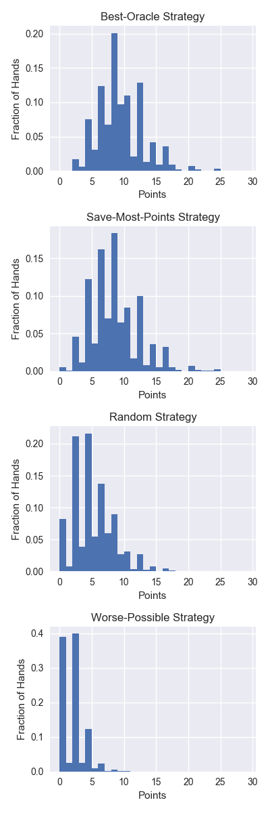
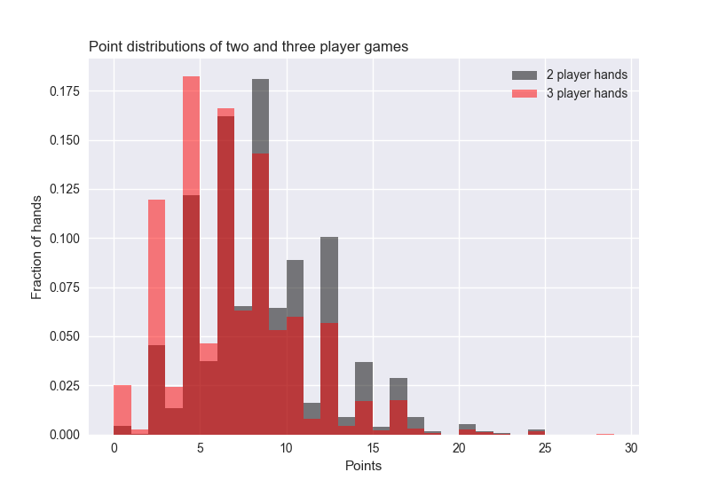

# cribbage-analysis
Summary statistics of a cribbage simulation

## Summary
I play a lot of cribbage, but I know nothing about the game odds.  It's a fairly complicated game, so I figure the best way to get at cribbage statistics is to simulate cribbage hands.

This repo basically includes 3 files:

* `cribbage.py` which subclasses `pydealer.stack.Stack` to create a `CribbageHand` class.  Most importantly, this contains a `score()` method which calculates the score of your cribbage hand.
* `simulation.py` which simulates cribbage hands with hardcoded throwing strategies
* `analysis.py` which generates plots and calculates summary statistics

## Strategies
I wrote 4 strategies for deciding which cards to keep
* **Keep the cards with the highest score before the cut**.  This is a fairly good beginner strategy
* **Keep the cards with the highest score after the cut**.  This is not a feasible strategy because it requires an oracle which could see the cut card.  However, it is a good ceiling on the best possible cribbage hands you could get.
* **Keep the cards with the lowest score after the cut**.  Again, not feasible, but a good lower bound.
* **Keep 4 random cards**.  I think this strategy is what my partner uses.

## Analysis

Below, I'm plotting 10,000 simulated hands for each strategy.  There's not much difference between keeping the 4 best cards with or without knowing what the cut card is.  Randomly throwing cards really hurts you.  It's hard to get points, but easy to randomly throw them away.

The most important take aways are the average points per hand each strategy generates:
* **Keeping the cards with the highest score before the cut** gets 8.2 points per hand
* **Keeping the cards with the highest score after the cut** gets 9.1 points per hand
* **Keeping the cards with the lowest score after the cut** gets 1.6 points per hand
* **Keeping 4 random cards** gets 4.7 points per hand

Whats interesting is that if all you do is keep the most scoring cards before the cut, you score only one point less than if you could make a perfect decision knowing what the cut card is.  I guess all the work I go through trying to calculate expected values in my head on the fly is a waste of time.

What is the probability of getting a really good hand?  Using the strategy of keeping the best 4 cards, **you get a 15+ point hand 5.7% of the time.**  Just rare enough to feel really good, but still happen about once a game.

Finally, what about **2 vs 3 player games**?  I always feel I score much less in 3 player games (due to the number of cards being less), but how strong is the effect? Below I simulated 10,000 games with 2 or 3 players, using the strategy where you save the best 4 card hand before the cut.

Three player games have a much higher probability of low scoring hands (2 and 4 points). The average hand is 6.5 in a three player game, **over 1.5 points per hand lower than a two player game**.  That's a lot.

## TODO
- Implement more strategies
